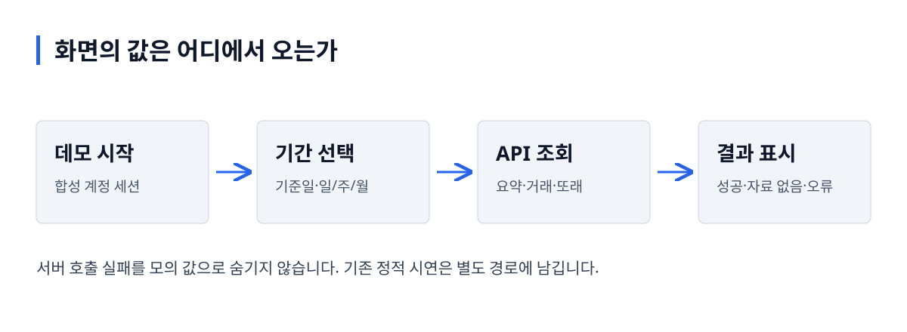

# FinMate App

**내 소비와 또래 평균을, 같은 자료 기준으로 읽는 화면입니다.**

가가제작소 팀 프로젝트의 React·TypeScript·Vite 앱입니다. 이번 개인 보강은 기본 경로를 실제 API 기반 소비 조회로 구성하고, 합성 데이터·자료 없음·서버 오류를 구분하는 데 집중했습니다.

[핵심 판단](#핵심-판단) · [검증 결과](#검증-결과) · [로컬 실행](#로컬-실행) · [코드 읽기](#코드-읽기)

## 실제 화면


실제 로컬 API를 연결한 데스크톱 화면입니다. 금액·거래·비교 인원은 서버에 적재한 합성 원장의 응답입니다.

<details>
<summary>모바일 화면</summary>


</details>

## 사용 흐름과 처리 구조

데모 시작 → 기준일·조회 기간 선택 → 소비 내역 → 같은 소득대 비교



그림 설명: 데모 시작 → 기간 선택 → API 조회 → 결과 표시. 서버 호출 실패를 모의 값으로 숨기지 않습니다. 기존 정적 시연은 별도 경로에 남깁니다.

## 핵심 판단

| 문제 | 선택 | 확인한 근거 |
|---|---|---|
| 화면에서 실제 응답과 정적 시연을 구분하기 어려웠습니다. | `/`는 API 기반 소비 조회, 기존 시연 경로는 정적 예시 안내로 구분합니다. | [라우터](src/app/router.tsx), [데이터 공급 계층](src/data/source.tsx) |
| 미적재 기간과 소비 0원이 같은 의미로 보일 수 있었습니다. | `NO_DATA`를 금액 0과 다른 화면 상태로 표시합니다. | [소비 조회 화면](src/features/spending/SpendingPage.tsx) |
| 여러 조회가 함께 토큰 만료를 만나면 갱신이 중복될 수 있었습니다. | 진행 중인 토큰 갱신을 공유합니다. | [API 클라이언트](src/api/client.ts) |

## 검증 결과

2026-10-02 로컬 검증: 타입 검사·빌드·lint 오류 0, 실제 API 데스크톱·모바일 **E2E 4개 통과**. 성공 조회는 실제 서버를 사용하고, 오류 표시 시험에서만 503을 주입합니다.

[화면 E2E](e2e/spending.spec.ts) · [API 검증 기록](https://github.com/gaga-studio/finmate-api/blob/main/docs/VERIFICATION.md) · [평균 정의와 측정 조건](https://github.com/gaga-studio/finmate-api/blob/main/docs/PERF_RESULT.md)

## 로컬 실행

먼저 [FinMate API](https://github.com/gaga-studio/finmate-api)에서 `docker compose -p finmate-rebuild -f compose.demo.yml up -d --build`를 실행합니다.

```bash
npm ci
npm run dev -- --host 127.0.0.1 --port 5175
```

화면은 `http://localhost:5175`입니다. Vite가 `/api`를 `127.0.0.1:18081`로 전달합니다. 데모 시작은 공개 합성 자료용 계정을 재사용합니다.

```bash
npm run build
npm run lint
npm run test:e2e
```

E2E에는 실행 중인 API와 Playwright Chromium이 필요합니다. 공개 배포에서는 `VITE_API_URL` 또는 같은 출처의 API 프록시를 실제 서버에 연결해야 합니다.

## 범위와 한계

`/my`, `/feed`, `/diary`, `/missions`, `/insights`, `/mate/:id`는 기존 팀 시연으로 보존했습니다. 금융 정보·추천의 실제 정확도나 사용자 반응을 검증한 서비스가 아닙니다. 기존 Fast Refresh·bundle 크기 경고는 별도 정리 대상입니다.

이번 개인 보강은 AI 지원으로 구현하고 로컬에서 검증했습니다. 코드로 확인한 동작·실험 관측·미검증 범위를 구분하며, 실제로 겪지 않은 운영 장애나 팀 전체 결과를 개인 성과로 표현하지 않습니다.

## 코드 읽기

[API 클라이언트](src/api/client.ts) → [SpendingPage](src/features/spending/SpendingPage.tsx) → [화면 E2E](e2e/spending.spec.ts). 서버의 평균에서 본인을 제외하는 작은 요구 변경을 해보고, 서버 테스트·응답·화면 설명을 함께 고치는 과제로 연결합니다.

[FinMate API](https://github.com/gaga-studio/finmate-api) · [서버 코드 읽기 안내](https://github.com/gaga-studio/finmate-api/blob/main/docs/SERVICE_GUIDE.md)
