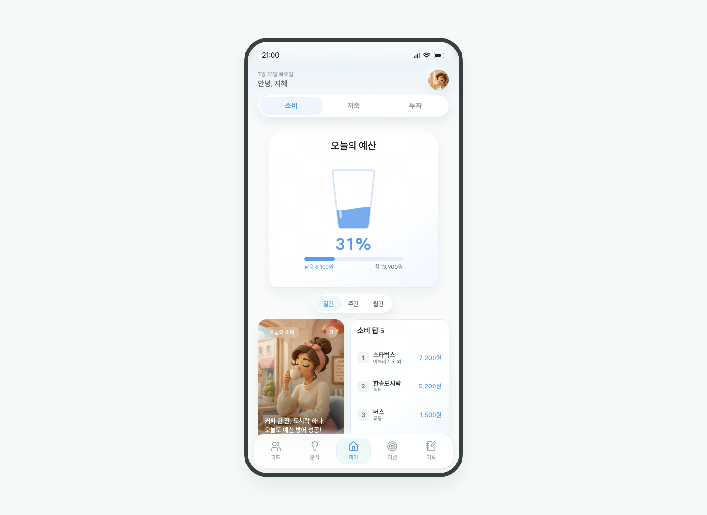
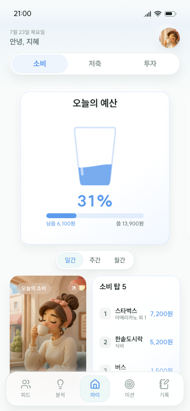
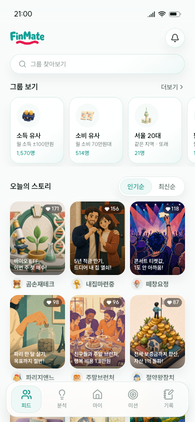
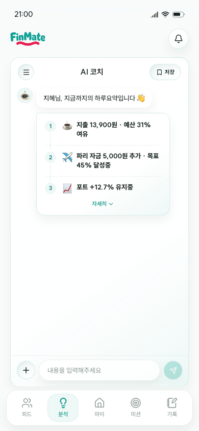
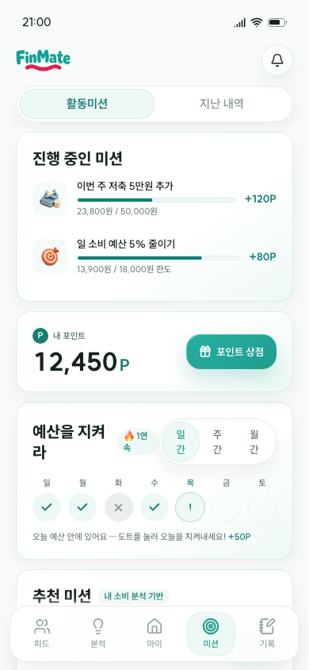
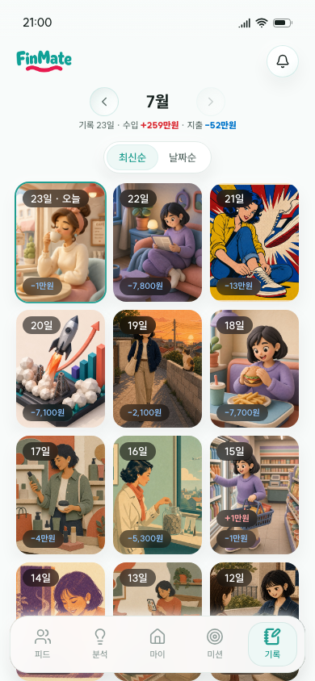

# FinMate

> 금융이 막막한 20대의 첫 금융 온보딩 서비스

금융관리를 시작해야 한다는 건 알지만, 무엇부터 해야 할지 막막할 수 있습니다. FinMate는 또래의 금융 생활을 구경하고, 내 소비를 돌아보고, 오늘 할 수 있는 작은 미션으로 이어지는 모바일 웹 서비스입니다.

하나금융그룹 × 금융감독원 **2026 청년 금융인재** 프로젝트에서 가가제작소 4인 팀으로 만들었습니다. 이 저장소는 FinMate의 모바일 웹앱입니다.

[백엔드](https://github.com/gaga-studio/finmate-api) · [데이터 프로젝트](https://github.com/gaga-studio/finmate-data) · [팀 발표자료](docs/FinMate-발표자료.pptx)

## 왜 만들었나요?

팀의 기획은 금융관리가 필요하다는 생각과 실제 행동 사이의 간격에서 출발했습니다. 어려운 용어와 많은 정보보다, 나와 비슷한 사람이 어떻게 돈을 쓰고 모으는지 보는 것이 더 친근한 시작점이 될 수 있다고 보았습니다.

그래서 두 가지 방향을 잡았습니다.

- **또래를 보며 시작하기**: 비슷한 소득·소비·지역의 메이트를 찾고, 그들의 금융 스토리를 살펴봅니다.
- **작은 행동으로 이어가기**: 막연한 고민을 오늘 할 수 있는 미션으로 나누고, 실행한 기록을 쌓습니다.

기획·리서치와 데이터 EDA는 팀원들의 작업입니다. 배경과 가설의 원자료는 위 팀 발표자료에 정리되어 있습니다. 현재 앱 시연이 이 가설의 효과나 실제 이용자의 재방문을 입증한 것은 아닙니다.

## 구경에서 실행까지

**또래 스토리**

그룹으로 찾기 → 금융 스토리 보기 → 메이트와 비교하기 → 내 금융 생활 돌아보기

**AI 코치와 미션**

생활 속 고민 입력 → 계획과 시뮬레이션 살펴보기 → 미션 수락 → 실행 기록 남기기

## 화면과 주요 기능



소비·저축·투자 카드와 다섯 탭으로 금융 생활을 살펴봅니다. 아래 화면은 고정 합성 데이터를 사용하는 팀 시연 모드입니다.

| 화면 | 할 수 있는 일 |
|---|---|
| **마이** | 물잔으로 예산, 게이지로 저축 목표, 그래프로 투자를 확인합니다. 카드를 가로로 넘기고 일간·주간·월간을 선택합니다. |
| **피드** | 소득·소비·지역이 비슷한 또래 그룹과 금융 스토리를 살펴봅니다. 메이트 프로필과 비교 화면으로 이어집니다. |
| **분석** | AI 코치 시연 대화에서 소비 고민을 입력하고, 저축 계획·미래 자산 시뮬레이션·메이트 비교를 체험합니다. |
| **미션** | 예산 지키기와 금융 퀴즈 등 작은 미션을 수행하고 포인트·챌린지 기록을 확인합니다. |
| **기록** | 하루의 소비를 그림일기와 일별 수입·지출 기록으로 돌아봅니다. |

아트 카드를 누르면 **Wrapped 공유 카드**가 열립니다. 세로 카드 이미지를 저장하거나 공유하는 흐름까지 체험할 수 있습니다.

<details>
<summary>모바일 화면 더 보기</summary>







</details>

## 현재 체험할 수 있는 범위

기본 실행은 발표·촬영을 위한 **고정 데이터 시연 모드**입니다. 실제 은행 계좌를 연결하지 않습니다. AI 코치의 대화, 그림일기, 메이트·그룹 비교, 미션 등은 준비된 시연 콘텐츠와 계산을 사용합니다.

`VITE_API_URL`을 설정하면 **같은 화면의 예산 카드와 소비 탑 5**가 백엔드의 합성 원장을 읽습니다. 이 두 영역은 서버 실패를 시연 금액으로 숨기지 않고, 자료가 없는 기간을 0원과 구분합니다. 다른 시연 기능까지 실시간 API나 실제 AI 서비스에 연결된 것은 아닙니다.

백엔드의 전체 거래 조회·소득대 평균 API는 별도로 제공하며, 현재 화면 연결 범위는 위 두 영역입니다. 온보딩의 상세 입력 단계는 아직 준비 중입니다.

## 로컬에서 실행하기

```bash
npm ci
npm run dev -- --host 127.0.0.1 --port 5175
```

`http://localhost:5175`에서 마이 화면으로 들어갑니다. 모바일에서는 전체 화면, 데스크톱에서는 430px 폰 프레임으로 표시됩니다.

백엔드 원장을 연결하려면 [FinMate API](https://github.com/gaga-studio/finmate-api)의 데모 서버를 먼저 실행한 뒤, 위 개발 서버 대신 다음 명령을 사용합니다.

```bash
VITE_API_URL=http://localhost:5175 npm run dev -- --host 127.0.0.1 --port 5175
```

개발 프록시가 `/api`를 `http://127.0.0.1:18081`로 전달합니다. 공개 환경의 API 주소와 허용 출처는 해당 환경에 맞춰 설정해야 합니다.

## 사용 기술

React 19 · TypeScript · Vite · Tailwind CSS · Motion · React Router. 차트는 SVG, 공유 이미지는 html-to-image를 사용합니다.

## 프로젝트 자료

- [시연 흐름](docs/시연-플로우.md) · [화면 디자인 가이드](docs/design-guide.md) · [이미지 출처](docs/assets/README.md)
- [개발·실행 구조](docs/SERVICE_GUIDE.md) · [검증 기록](docs/VERIFICATION.md)
- [finmate-api](https://github.com/gaga-studio/finmate-api): 금융 조회·집계 API
- [finmate-data](https://github.com/gaga-studio/finmate-data): 카드 이용 데이터 EDA와 합성 원장 생성

팀 프로젝트 이후의 개인 보강에서는 API 연결과 데이터 오류 처리를 다뤘습니다. 구현·검증에 AI를 활용했으며, 팀의 기획·리서치 결과와 개인 보강 범위를 구분합니다.
